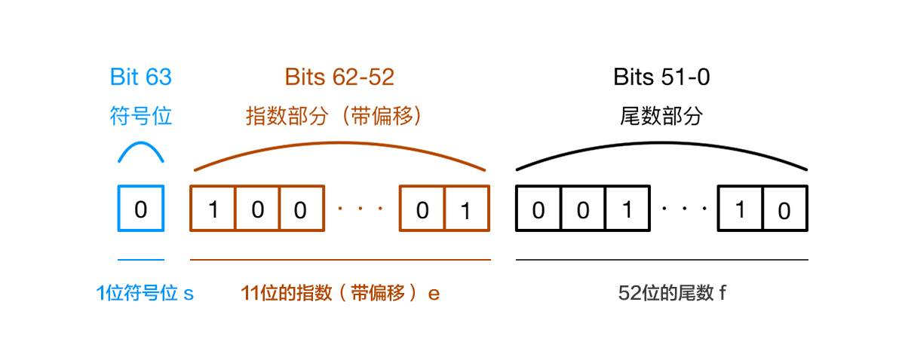

### 为什么在JavaScript里面$0.1+0.2=0.3$

#### JavaScript中Number类型的表示

- 在JavaScript中，不管是整数还是浮点数，都遵循IEEE 754标准,一个64位二进制数来表示一个数字。
- 其中最高位为符号位，随后是11位的指数和52位的尾数，但尾数M的最高位可默认为1，实际上是53位有效数字。



#### $0.1+0.2=0.3$的过程

- 将0.1和0.2用二进制表示：

  > 0.1 -> 0.0001100110011001=1.10011001…$\times2^{-4}$
  > 因此最终存储为
  >
  > S：0
  >
  > E：01111111001（-4）
  >
  > M：1001100110011001100110011001100110011001100110011010 （最后一位舍入）
  >
  > 同理0.2存储为
  >
  > S：0
  >
  > E：01111111100  （-3）
  >
  > M：1001100110011001100110011001100110011001100110011010（最后一位舍入）

- 进行运算：分为三个步骤：

  1. 对阶：要对0.1进行移位，时其阶码与0.2相同。阶码每增大1，M就要向右移一位。

     > E: 01111111100（-3）
     >
     > M：1100110011001100110011001100110011001100110011001101（最后一位舍去，高位补最高位1）

  2. 尾数求和

     > 求得和的尾数为（1）0011001100110011001100110011001100110011001100110100 
     >
     > 其中最高位出现一个进位，因此阶码需要加一，得到阶码为-2；最低位也要舍入

  3. 转换为十进制

     > $1.0011001100110011001100110011001100110011001100110100\times2\times 10^{-2}=0.30000000000000004$
     >
     > 不等于0.3

- 由于各步骤（存储，移位和求和）的舍入误差，导致最后的结果不是0.3。

#### 解决方案

- 使用bignumber.js库

  ```javascript
  const BigNumber = require('bignumber.js');
  console.log(.1 + .2); // 0.30000000000000004
  
  // bignumber.js 
  const x = new BigNumber(0.1);
  const y = 0.2
  console.log(parseFloat(x.plus(y)));//0.3
  
  console.log(x.plus(y)==0.3);//true
  ```

- 在精度范围要求内判断

  ```javascript
  console.log(Math.abs(.1+.2-0.3)<1e-10);//true
  ```

  